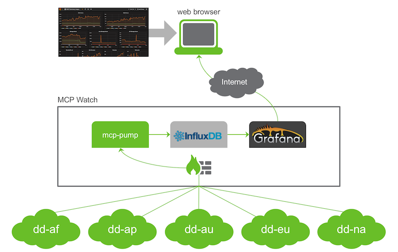

# The MCP Watch project

Pump logs from the global [Managed Cloud Platform](http://www.dimensiondata.com/Global/Solutions/Cloud/) from Dimension Data, monitor resource consumption over time and dig into visual analytics.

## Why this project?

The cloud API from Dimension Data has been exposing very detailed consumption information since its inception. This provides:
- summary usage report, that presents total of resources used per day and per data centre,
- detailed usage report, that lists resources and periods of consumption,
- audit log, that has all actions performed on the virtual infrastructure either from CloudControl web console or API

Advanced clients are using this comprehensive source of data for various usages, for example:
- monitor consumption of cloud services and ensure that it stays below some threshold
- breakdown consumption reports and show them back to multiple business units
- ingest the audit log into some SIEM system and contribute to cyber-security

However, we could observe that many clients just do not leverage data made available to them, either because they are lacking of analytics back-end and of expertise, or because they are just looking for a lightweight and standalone solution.

MCP Watch is a concrete response to this situation. With this project we provide a beautiful dashboard that can be setup quickly by any practitioner of the Managed Cloud Platform.

The project is dedicated to the global community of clients and employees who use cloud services from Dimension Data for their virtual infrastructure. MCP Watch can be used either as an operational dashboard where powerful analytics can be done visually, or as a smart demonstration of Dimension Data API capabilities.

The MCP Watch project is ruled by the [Apache License](https://www.apache.org/licenses/LICENSE-2.0). In other terms, it is an open source project, so we rely on volunteers to show up and to contribute. [Contributions and feedback](docs/contributing.md) are welcome, and they are greatly appreciated! Every little bit helps, and credit will always be given.

## How is this done?

The system has a computer that is constantly pumping data from various MCP regions, and feeding an InfluxDB database. Then dynamic dashboards can be build and accessed from a regular web browser, thanks to Grafana.

The `mcp-pump` piece of software is written in python and relies on the Apache Libcloud for interactions with the API from Dimension Data. Any computer that can run the python interpreter and that can connect to the public Internet is eligible for the MCP Watch. This can be your own workstation for a quick test or for a demo. Or it can be a small computer like a Raspberry Pi. Or any general-purpose computer, really. And, of course, it can be a virtual server running in the cloud.

The two other components of the architecture are open source industry-class packages.

[InfluxDB](https://www.influxdata.com/time-series-platform/influxdb/) is an open source database written in Go specifically to handle time series data with high availability and high performance requirements.

[Grafana](http://grafana.org/) is an open source metric analytics & visualization suite. It is most commonly used for visualizing time series data for infrastructure and application analytics but many use it in other domains including industrial sensors, home automation, weather, and process control.

Our objective is that `mcp-pump` can interface with various analytics systems. The architecture is open, so that it can be extended quite easily. We are looking for the addition of Elasticsearch and of MongoDB. If you are interested, please have a look at the [contributing page](docs/contributing.md).

## What is needed to deploy MCP Watch?

The minimum viable solution we could think of is really compact:
* a computer that runs `mcp-pump`, InfluxDB and Grafana, and that has access to public Internet over HTTPS,
* MCP credentials so that the pump can fetch data from the Dimension Data API,
* some instructions and goodwill :-)

Check [detailed instructions](docs/setup-influxdb-grafana.md) for step-by-step deployment of a running installation.

Below is an example settings for the widget that reports on CPU hours. Each region has a different line in the diagram, yet this could be segmented by location to get more details.

## Where to find additional assistance?

Well, maybe you would like to check [Frequently asked questions](docs/questions.md) and related responses.
Then you can [raise an issue at the GitHub project page](https://github.com/bernard357/mcp-pump/issues) and get support from the project team.

If you are a Dimension Data employee, reach out the Green Force group at Yammer and engage with
other digital practitioners.

## How would you like to contribute?

We want you to feel as comfortable as possible with this project, whatever your skills are.
Here are some ways to contribute:

* [use it for yourself](docs/contributing.md#how-to-use-this-project-for-yourself)
* [communicate about the project](docs/contributing.md#how-to-communicate-about-the-project)
* [submit feedback](docs/contributing.md#how-to-submit-feedback)
* [report a bug](docs/contributing.md#how-to-report-a-bug)
* [write or fix documentation](docs/contributing.md#how-to-improve-the-documentation)
* [fix a bug or an issue](docs/contributing.md#how-to-fix-a-bug)
* [implement some feature](docs/contributing.md#how-to-implement-new-features)

Every [contribution and feedback](docs/contributing.md) matters, so thank you for your efforts.
