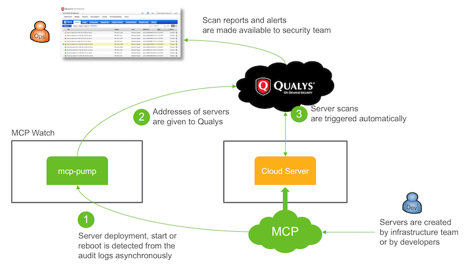
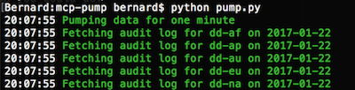
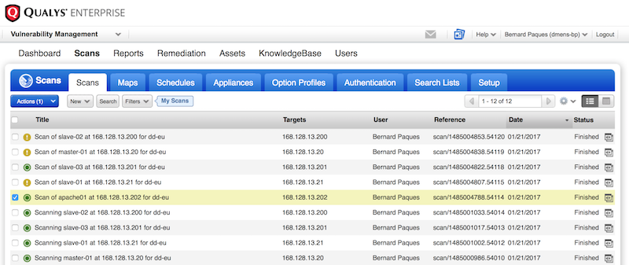

# Setup MCP Watch with Qualys

On this page you will find instructions to install MCP Watch with Qualys.



Since Qualys is ran as a public cloud service, you need a computer only
to run the `mcp-pump` software itself. This computer should be given access
to public Internet, so that it can interact with the API endpoints.
Of course, you also need credentials for cloud services from Dimension Data and from
Qualys.

## Install the pump

For this installation you need a computer that can run python programs,
plus some tools to download software from python public repository, and from GitHub.

Pre-requisites:
- [python 2.7 and pip](https://www.python.org/downloads/)
- [git](https://git-scm.com/downloads)
- [Apache Libcloud](https://libcloud.readthedocs.io/en/latest/getting_started.html)

Download the `mcp-pump` code directly from GitHub:

```
$ git clone https://github.com/bernard357/mcp-pump.git
$ cd mcp-pump
$ pip install -r requirements.txt
```

As an overall example, if you use a Ubuntu or macOs machine, you could do the following:

```bash
$ sudo apt-get install -y ntp python-pip git apache-libcloud
$ cd ~
$ git clone https://github.com/bernard357/mcp-pump.git
$ cd mcp-pump
$ sudo pip install -r requirements.txt
```

## Configure the pump

All configuration parameters have been centralised in a single file used by `mcp-pump`:

```
$ sudo nano config.py
```

Every module has a separate section, so it should be easy to move around.
Check the Qualys section and ensure that the module has been activated.
Also double-check the URL that will be used to interact with the Qualys API endpoint.
For example if you are located in Europe:

```
qualys = {
    'active': True,
    'url': 'https://qualysguard.qualys.eu/',
    'login': '$QUALYS_LOGIN',
    'password': '$QUALYS_PASSWORD',
    }
```

Save changes with `Ctl-O` and exit the editor with `Ctl-X`.

Put MCP credentials in environment variables:

```
$ export MCP_USER='foo.bar'
$ export MCP_PASSWORD='WhatsUpDoc'
```

Put Qualys credentials also in environment variables:

```
$ export QUALYS_LOGIN='who.knows'
$ export QUALYS_PASSWORD='76gjTdc86'
```

For permanent changes you may put these variables in a file
that is loaded automatically by the operating system.

For example if you are running Ubuntu or macOs you could do:

```
$ nano ~/.bash_profile
```

and type text like the following:

```
# MCP credentials
export MCP_USER='foo.bar'
export MCP_PASSWORD='WhatsUpDoc'

# Qualys credentials
export QUALYS_LOGIN='who.knows'
export QUALYS_PASSWORD='76gjTdc86'
```

Save changes with `Ctl-O` and exit the editor with `Ctl-X`.
Then close all terminal windows, and re-open one to ensure that environment variables have been updated.

## Start the pump

```
$ python pump.py
```



At this stage, the pump will detect every minute if some server has been started or rebooted in the cloud.
If the server has a public ip address, it will be scanned automatically by Qualys.

As a matter of test, you may prepare a bare cloud server directly from CloudControl:
- select a data centre in one of the regions covered by MCP Watch
- add a network domain, or pick up an existing one
- add a VLAN, or use an existing one
- deploy a server based on an image of your choice
- add a NAT rule so that the server can be exposed to the internet
- add some firewall rules so hat the server can be reached on well-known ports, e.g., 22, 80, 443

When all this has been done, reboot the server and wait for one minute or two.

Of course, if multiple persons in your organisation use cloud services from Dimension Data,
it may happen that you just benefit from server starts and reboots triggered by others.

## Check scanning reports

Start the Qualys from your preferred web browser, so that you can monitor the scans performed
and their results.



## Where to go from here?

If something goes wrong for some reason, then [the frequently questions page](questions.md) may help you to troubleshoot the issue and fix it.
Then you can [raise an issue at the GitHub project page](https://github.com/bernard357/mcp-pump/issues) and get support from the project team.
If you are a Dimension Data employee, reach out the Green Force group at Yammer and engage with
other digital practitioners.

On the other hand, if you are happy with this project, we would be happy to receive some [feedback or contribution](docs/contributing.md) in return.
We want you to feel as comfortable as possible with this project, whatever your skills are.
Here are some ways to contribute:

* [use it for yourself](docs/contributing.md#how-to-use-this-project-for-yourself)
* [communicate about the project](docs/contributing.md#how-to-communicate-about-the-project)
* [submit feedback](docs/contributing.md#how-to-submit-feedback)
* [report a bug](docs/contributing.md#how-to-report-a-bug)
* [write or fix documentation](docs/contributing.md#how-to-improve-the-documentation)
* [fix a bug or an issue](docs/contributing.md#how-to-fix-a-bug)
* [implement some feature](docs/contributing.md#how-to-implement-new-features)
