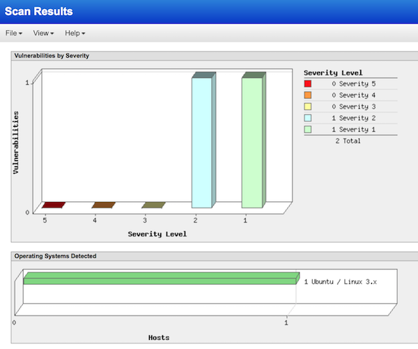

# Setup MCP Watch with Qualys

On this page you will find instructions to install [MCP Watch](https://github.com/bernard357/mcp-pump) with [Qualys](https://www.qualys.com/).


[Qualys](https://www.qualys.com/) is a provider of cloud security, compliance and related services based in Redwood Shores, California. Founded in 1999, Qualys was the first company to deliver vulnerability management solutions as applications through the web using a "software as a service" (SaaS) model. It has added cloud-based compliance and web application security offerings.

Qualys has thousands od customers in more than 100 countries, including a majority of the Forbes Global 100. The company has strategic partnerships with major managed services providers and consulting organizations including BT, Dell SecureWorks, Fujitsu, IBM, NTT, Symantec, Verizon, and Wipro. The company is also a founding member of the Cloud Security Alliance (CSA).

Since Qualys is ran as a public cloud service, for this integration you need a computer only
to run the `mcp-pump` software itself. This computer should be given access
to public Internet, so that it can interact with the API endpoints.
Of course, you also need credentials for cloud services from Dimension Data and from
Qualys.

## Install the pump

For this installation you need a computer that can run python programs,
plus some tools to download software from python public repository, and from GitHub.

Pre-requisites:
- [python 2.7 and pip](https://www.python.org/downloads/)
- [git](https://git-scm.com/downloads)
- [Apache Libcloud](https://libcloud.readthedocs.io/en/latest/getting_started.html)

Download the `mcp-pump` code directly from GitHub:

```
$ git clone https://github.com/bernard357/mcp-pump.git
$ cd mcp-pump
$ pip install -r requirements.txt
```

As an overall example, if you use a Ubuntu or macOs machine, you could do the following:

```bash
$ sudo apt-get install -y ntp python-pip git
$ cd ~
$ git clone https://github.com/bernard357/mcp-pump.git
$ cd mcp-pump
$ sudo pip install -r requirements.txt
```

## Configure the pump

All configuration parameters have been centralised in a single file used by `mcp-pump`:

```
$ sudo nano config.py
```

Every module has a separate section, so it should be easy to move around.
Check the Qualys section and ensure that the module has been activated.
Also double-check the URL that will be used to interact with the Qualys API endpoint.
For example if you are located in Europe:

```
qualys = {
    'active': True,
    'url': 'https://qualysguard.qualys.eu/',
    'login': '$QUALYS_LOGIN',
    'password': '$QUALYS_PASSWORD',
    }
```

Save changes with `Ctl-O` and exit the editor with `Ctl-X`.

Put MCP credentials in environment variables:

```
$ export MCP_USER='foo.bar'
$ export MCP_PASSWORD='WhatsUpDoc'
```

Put Qualys credentials also in environment variables:

```
$ export QUALYS_LOGIN='who.knows'
$ export QUALYS_PASSWORD='76gjTdc86'
```

For permanent changes you may put these variables in a file
that is loaded automatically by the operating system.

For example if you are running Ubuntu or macOs you could do:

```
$ nano ~/.bash_profile
```

and type text like the following:

```
# MCP credentials
export MCP_USER='foo.bar'
export MCP_PASSWORD='WhatsUpDoc'

# Qualys credentials
export QUALYS_LOGIN='who.knows'
export QUALYS_PASSWORD='76gjTdc86'
```

Save changes with `Ctl-O` and exit the editor with `Ctl-X`.
Then close all terminal windows, and re-open one to ensure that environment variables have been updated.

## Start the pump

```
$ python pump.py
```


At this stage, the pump will detect every minute if some server has been started or rebooted in the cloud.
If the server has a public ip address, it will be scanned automatically by Qualys.

If multiple persons in your organisation use cloud services from Dimension Data,
you will benefit from server starts and reboots triggered by others.

You may also want to activate a cloud server by yourself, directly from CloudControl console:
- select a data centre in one of the regions covered by your MCP Watch instance
- add a network domain, or pick up an existing one
- add a VLAN, or use an existing one
- deploy a server based on an image of your choice
- add a NAT rule so that the server can be exposed to the internet
- add some firewall rules so hat the server can be reached on well-known ports, e.g., 22, 80, 443

When all this has been done, reboot the server and wait for one minute or two.
MCP Watch should log a new scanning test, and this should be reflected into the Qualys console as well.

## Check scanning reports

Open the Qualys console from your preferred web browser, so that you can list scans that have been performed
and their results.


Scanning reports may provide very useful recommendations, that deserve the full attention of cyber-security practitioners.
In most cases, these would be implemented either in custom server images or in the DevOps orchestration toolbox.



## Where to go from here?

Visit [the frequently asked questions page](questions.md) since it contains a lot of information that may prove useful.
Then you can [raise an issue at the GitHub project page](https://github.com/bernard357/mcp-pump/issues) and get support from the project team.
If you are a Dimension Data employee, reach out the Green Force group at Yammer and engage with
other digital practitioners.

On the other hand, if you are happy with this project, we would be happy to receive some [feedback or contribution](docs/contributing.md) in return.
We want you to feel as comfortable as possible with this project, whatever your skills are.
Here are some ways to contribute:

* [use it for yourself](docs/contributing.md#how-to-use-this-project-for-yourself)
* [communicate about the project](docs/contributing.md#how-to-communicate-about-the-project)
* [submit feedback](docs/contributing.md#how-to-submit-feedback)
* [report a bug](docs/contributing.md#how-to-report-a-bug)
* [write or fix documentation](docs/contributing.md#how-to-improve-the-documentation)
* [fix a bug or an issue](docs/contributing.md#how-to-fix-a-bug)
* [implement some feature](docs/contributing.md#how-to-implement-new-features)

Our mid-term objective is that `mcp-pump` can interface with various security systems. The architecture is open, so that it can be extended quite easily. We are looking for the addition of Elasticsearch and of Splunk. If you are interested, please have a look at the [contributing page](contributing.md).

